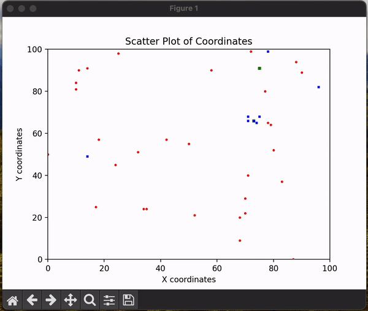

# Food Delivery Simulator

## Visão Geral

O **Food Delivery Simulator** é um simulador de entrega de comida desenvolvido utilizando a biblioteca de simulação de eventos discretos **SimPy**. O simulador foi adaptado para funcionar como um ambiente compatível com **Gymnasium**, permitindo experimentos com **Aprendizado por Reforço**. O objetivo é testar e treinar agentes utilizando algoritmos como **PPO (Proximal Policy Optimization)** da biblioteca **Stable-Baselines3**.



## Requisitos

- Python 3.6 ou superior
- Gymnasium
- SimPy
- Stable-Baselines3
- Outras dependências listadas em `requirements.txt`

## Configuração do Ambiente

### 1️⃣ Criar e ativar o ambiente virtual do Python

#### No Windows:
```shell
python -m venv venv
Set-ExecutionPolicy Unrestricted -Scope Process
.\venv\Scripts\activate
```

#### No Linux/Mac:
```shell
python -m venv venv
source venv/bin/activate
```

### 2️⃣ Instalar as dependências
```shell
python -m pip install -r requirements.txt
```

### 3️⃣ (Apenas no Linux) Instalar `python-tk` para usar o Matplotlib
```shell
sudo apt-get install python3-tk
```

## Uso do Simulador

### 🔹 Sempre que for usar o script Python, ative o ambiente virtual:

#### No Windows:
```shell
Set-ExecutionPolicy Unrestricted -Scope Process
.\venv\Scripts\activate
```

#### No Linux/Mac:
```shell
source venv/bin/activate
```

### 🔹 Rodar o script do teste do simulador:
```shell
python -m src.examples.test
```

## Treinamento de Agentes de Aprendizado por Reforço

Para treinar um agente PPO com o ambiente do simulador. É necessário primeiramente montar um cenário experimental definindo o valor dessas constantes:

```python
NUM_DRIVERS = 10
NUM_ORDERS = 12*24 # 12 pedidos por hora durante 24 horas
NUM_ESTABLISHMENTS = 10
NUM_COSTUMERS = NUM_ORDERS
GRID_MAP_SIZE = 50 # Tamanho do grid 50x50
REWARD_OBJECTIVE = 1
MAX_TIME_STEP = 60*24*2 # 2 dias
# 2 pedidos de 10 em 10 minutos
FUNCTION = lambda time: 2
LAMBDA_CODE = "lambda time: 2"
TIME_SHIFT = 10

# Variáveis para criação dos Motoristas
VEL_DRIVERS = [3, 5]

# Variáveis para criação dos Estabelecimentos
PREPARE_TIME = [20, 60]
OPERATING_RADIUS = [5, 30]
PRODUCTION_CAPACITY = [4, 4]

# Variável que controla quando o motorista deve ser alocado
# A porcentagem se refere ao progresso de preparação do pedido
# Exemplo: 0.7 indica que o motorista deve será alocado quando o pedido estiver 70% pronto
PERCENTAGE_ALLOCATION_DRIVER = 0.7

NORMALIZE = True
```

Tendo em mente que a constante `REWARD_OBJECTIVE` define como as recompensas serão calculadas. O valores possíveis são `1` para **Minimizar o tempo de entrega** e `2` para **Minimizar o custo de operação (distância)**.

Crie então o ambiente gymnasium de simulação de entrega de comida a partir das constantes definidas e realize o treinamento:


```python
from stable_baselines3 import PPO
from simulator_env import FoodDeliveryEnv

# Criar o ambiente
env = FoodDeliveryGymEnv(
    num_drivers=NUM_DRIVERS,
    num_establishments=NUM_ESTABLISHMENTS,
    num_orders=NUM_ORDERS,
    num_costumers=NUM_COSTUMERS,
    grid_map_size=GRID_MAP_SIZE,
    vel_drivers=VEL_DRIVERS,
    prepare_time=PREPARE_TIME,
    operating_radius=OPERATING_RADIUS,
    production_capacity=PRODUCTION_CAPACITY,
    percentage_allocation_driver=PERCENTAGE_ALLOCATION_DRIVER,
    use_estimate=True,
    desconsider_capacity=True,
    max_time_step=MAX_TIME_STEP,
    reward_objective=REWARD_OBJECTIVE,
    function=FUNCTION,
    lambda_code=LAMBDA_CODE,
    time_shift=TIME_SHIFT,
    normalize=NORMALIZE,
    render_mode='human'
)

# Criar e treinar o modelo PPO
model = PPO("MultiInputPolicy", env, verbose=1, tensorboard_log="ppo_tensorboard/")
model.learn(total_timesteps=10000)

# Salvar o modelo treinado
model.save("ppo_food_delivery")
```

### Treinamento do Agentes RL a partir dos scripts prontos

#### 1️⃣ Script `train_ppo_model`
Utilize o script `train_ppo_model` localizado na pasta `src.examples` para realizar o treinamento do agente RL. Neste arquivo as constantes do cenário experimental já foram definidas, mas fique a vontade para alterá-las conforme seus objetivos.

Defina um caminho de um diretório a sua escolha para o salvamento dos modelos, logs e gráficos do treinamento:

```python
RESULTS_DIR = "C:/Users/marco/OneDrive/Área de Trabalho/teste/"
```

Defina o número `total_timesteps` e os outros hiperparâmetros conforme seus objetivos:

```python
model.learn(total_timesteps=10000, callback=eval_callback)
```

#### 2️⃣ Script `run_optimizer`

Utilize o script `run_optimizer` localizado na pasta `src.examples` para realizar multiplas execuções dos agentes sobre o ambiente gymnasium e analisar as estatisticas gerais. Os Agentes disponíveis são: **Aleatório**, **Primeiro Motorista**, **Motorista mais Perto**, **Função de Custo** e o **Agente de RL**.

Neste arquivo as constantes do cenário experimental já foram definidas, mas fique a vontade para alterá-las conforme seus objetivos.

Defina um caminho de um diretório a sua escolha para o salvamento dos modelos, logs e gráficos do treinamento:

```python
RESULTS_DIR = "C:/Users/marco/OneDrive/Área de Trabalho/teste/"
```

Para escolher qual agente utilizar basta comentar o agente selecionado anteriormente e descomentar o agente desejado:

```python
#optimizer = RandomDriverOptimizerGym(gym_env)
#optimizer = FirstDriverOptimizerGym(gym_env)
#optimizer = NearestDriverOptimizerGym(gym_env)
#optimizer = LowestCostDriverOptimizerGym(gym_env, cost_function=SimpleCostFunction())
optimizer = RLModelOptimizerGym(gym_env, PPO.load("./best_model/best_model_6000000.zip"))
```

Defina também a quantidade de execuções:

```python
num_runs = 10
```

##### 1️⃣ Agente de Aprendizado Por Reforço

Para rodar o agente de Aprendizado Por Reforço é necessário primeiramente treinar um modelo e gerar um arquivo com o modelo em um arquivo `.zip`. É necessário passar o caminho do arquivo com o modelo como um parâmetro da seguinte função:

```python
optimizer = RLModelOptimizerGym(gym_env, PPO.load("./best_model/best_model_6000000.zip"))
```

##### 2️⃣ Agente Heurístico da Função de Custo

Para rodar o agente heurístico da Função de Custo é necessário primeiramente definir uma função de custo em uma classe separada. A classe deve ser implementada a partir da interface `CostFunction`:

```python
class CostFunction(ABC):

    @abstractmethod
    def cost(self, map: Map, driver: Driver, route_segment: RouteSegment) -> Number:
        pass
```

##### 3️⃣ Adição de mais Agentes

É possível adicionar mais agentes para atuar sobre o ambiente. Para isso é necessário implementar um `Otimizador` a partir da interface `OptimizerGym` e sobreescrever as funções `select_driver` e `get_title`, assim como no exemplo abaixo:

```python
class RLModelOptimizerGym(OptimizerGym):

    def __init__(self, environment: FoodDeliveryGymEnv, model: PPO):
        super().__init__(environment)
        self.model = model

    def get_title(self):
        return "Otimizador por Aprendizado por Reforço"

    def select_driver(self, obs: dict, drivers: List[Driver], route: Route):
        action, _states = self.model.predict(obs)
        return action
```